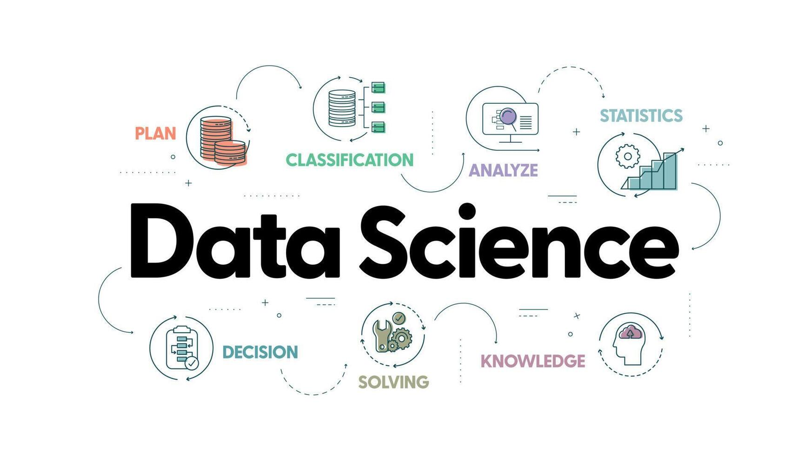

  

<h1 align="center">Hi 👋, I'm Naveen</h1>

👯 I’m looking to collaborate on **ML/AI/Data Science**   
📫 How to reach me: [naveenm2020ai@gmail.com] 

### 📫 Connect with Me  

  <!-- LinkedIn -->
  <a href="https://www.linkedin.com/in/naveen-m-4365a0200/" target="_blank">
    

### 🚀 About Me  
I'm currently learning **Data Science**, focusing on:  
- **Machine Learning** 🤖  
- **Exploratory Data Analysis (EDA)** 📊  
- **Statistics & Data Visualization** 📈  

### 🛠️ Tech Stack  
- **Programming:** Python, SQL  
- **Libraries:** NumPy, Pandas, Scikit-Learn, TensorFlow/PyTorch  
- **Visualization:** Matplotlib, Seaborn, Plotly
- **Business Process Management (BPM):** Pega

### 🌱 Currently Learning  
- Advanced ML Techniques  
- Deep Learning   
### ✅ I code in
   

### 🖥️ IDE and Tools I Use
    

